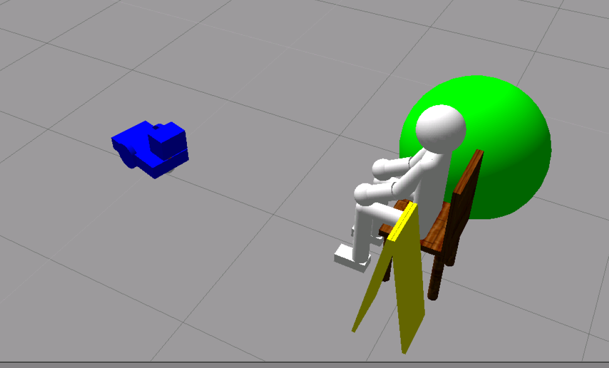
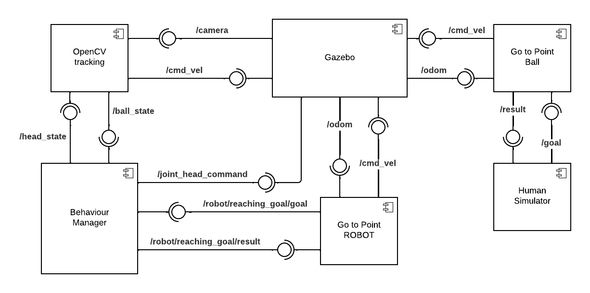
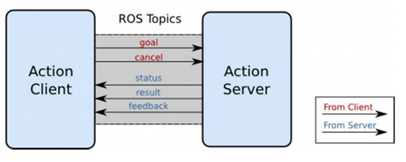
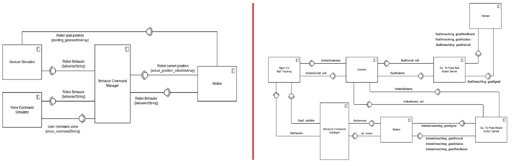
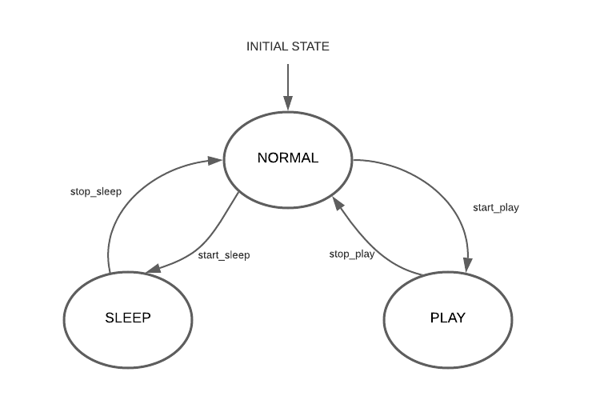

<!--
*** Thanks for checking out the Best-README-Template. If you have a suggestion
*** that would make this better, please fork the repo and create a pull request
*** or simply open an issue with the tag "enhancement".
*** Thanks again! Now go create something AMAZING! :D
-->

<!-- PROJECT LOGO -->
<br />
<p align="center">
  <a href="https://github.com/SerenaRoncagliolo/Exp_Robotics_Lab1">
    
  </a>

  <h3 align="center">Assignment 2 - Pet Behavioural Architecture</h3>
</p> 


<!-- TABLE OF CONTENTS -->
<details open="open">
  <summary><h2 style="display: inline-block">Table of Contents</h2></summary>
  <ol>
    <li>
      <a href="#about-the-project">About The Project</a>
      <ul>
        <li><a href="#built-with">Built With</a></li>
      </ul>
    </li>
    <li>
      <a href="#software-architecture">Software Architecture</a>
      <ul>
        <li><a href="#components-architecture">Components Architecture</a></li>
        <li><a href="#action-servers">Action Servers</a></li>
        <li><a href="#state-machine">State Machine</a></li>
        <li><a href="#ros-topics">ROS Topics</a></li>
        <li><a href="#ros-messages">ROS Messages</a></li>
        <li><a href="#rqt">Rqt_graphs</a></li>
      </ul>
    </li>
    <li><a href="#repository-organization">Repository Organization</a></li>
    <li><a href="#prerequisites">Prerequisites</a></li>
    <ul>
        <li><a href="#ros">ROS</a></li>
        <li><a href="#python">Python</a></li>
     </ul>
    <li><a href="#installation">Installation</a></li>
    <li><a href="#working-hypo">Working hypothesis and environment</a></li>
    <ul>
        <li><a href="#system-features">System's features</a></li>
        <li><a href="#system-limitations">System's limitations</a></li>
        <li><a href="#future-work">Future work</a></li>
    </ul>
  </ol>
</details>


<!-- ABOUT THE PROJECT -->
## About The Project

This system is built to simulate and environment where a human, a robot and a ball are spawned. The robot should follow three different behaviours: Normal, Sleep and Play. The robot is a wheeled dog having a camera located on top of its head. The human simulated represents the user that controls the movements of the ball within the environment. The human is not actually controlling the motion of the ball, since this last one is defined as a robot with one link capable of moving within the environment using speficic topics. The human can move the ball around, by giving a command position to reach, and make the ball disappear.
The objective of this project was to modify the provided robot model by using additional links and joints, build a suitable ROS architecture to implement the robot’s behaviors and simulate the system behavior on Gazebo.
In this project, the pet robot can assume three behaviors:
* NORMAL, when it moves randomly within the environment
* SLEEP, when it moves to a predefined position and stops there for a given time;
* PLAY, when it sees the ball and start playing with it.


### Built With
The project was build with:

* [ROS Kinetic](http://wiki.ros.org/kinetic/Installation/Ubuntu)
* [Python3](https://www.python.org/downloads/)
* [SMACH](http://wiki.ros.org/smach)


## Software Architecture

### Simulation 
Our project is simulated in a 3D [**Gazebo**](http://gazebosim.org/) environment. Gazebo is a 3D dynamic simulator that efficiently simulate robots in complex indoor and outdoor environments. It provides physics simulation having a rich library of robot models and environments, a wide variety of sensors, and a user-friendly graphical interface.

### Robot model 
We developed a rough and simple 3D model to simulate a pet robot within Gazebo. The robot is made up of two classic wheels and a spherical one that allow it to move. We added a cylinder to simulate the neck and fixed it to the chassis, while we use a cube to simulate the robot head. The head is connected to the neck through a revolute joint, that can perform a rotation of 180 degrees.  A camera has been applied to the robot's head to make it capable of detecting the ball.
If we want to simulate a robot on Gazebo or any other simulation software, we need to add physical and collision properties, such as the dimension of the geometry to calculate the possible collisions, the weight that will give us the inertia, and so on. To do so we use two files: a URDF and a XACRO (“XML Macros) file.
URDF is an XML file format used in ROS to describe all elements of a robot. In this file additional simulation-specific tags can be added to work properly with Gazebo as explained in this [link](http://gazebosim.org/tutorials?tut=ros_urdf&cat=connect_ros). URDF files can only specify the kinematic and dynamic properties of a single robot in isolation and not the pose of the robot itself within a world. The XACRO file instead helps in reducing the overall size of URDF files and makes it easier to read and maintain the packages. We can use it to create modules that can be reused in the URDF, in case of repeated structures, such as the wheels of a robot. 

<p align="center">
<a>
    
</a>
</p>

To interact with the simulation environment, we use ROS plugins which can be used to add functionalities for simulation purposes, such as controlling the robot mode or adding sensors like cameras.
In our project, we use ROS_Control which consists of a set of packages for controller interface, controller manager, transmissions, hardware interfaces and control toolbox. It can be used to control the joint actuators of the robot.


### Components Architecture

<p align="center">
<a>
    
</a>
</p>

**Components**  
* **Behavior Command Manager:** this component simulate the Finite State Machine (FSM) and control the switching between the hree robot behaviors described in details in the section **State Machine**: 
  * Normal
  * Sleep
  * Play
The component subscribed to two topics:
 * /ball_visible topic: it tells the component if the ball is visible or not in the camera range of the robot, in this case the roboto should switch to Play behavior, in which it starts "playing" with the ball by following it around;
 * /at_home topic: when the robot receives the command to go to sleep, it is supposed to reach first a given position, defined as "home position". If it has reached it, the motion robot publish it on the topic /at_home, which is subscribed by the behavior manager to check if the robot can enter sleep behaviour
This component publishes the robot behavior as a ROS message on the topic /behavior depending on the subscribed data received.
* **Motion:** this component moves the robot when it assumes Normal or Sleep behavior. To get information regarding the current behavior of the robot, it subscribes to the /behaviour topic and moves the robot accordingly. The motion component also instantiate a SimpleActionClient that is used to communicate with the _Go To Point Robot_ Action Server. This is done to set the correct goal position. When the robot is in Normal state, the motion component makes it move randomly within the environment, by choosing a random goal position and waits for the Server to report back as feedback information if it has reached the goal or not. in the Sleep state, instead, the motion controller moves the robot to _home position_ and when it's reached, it report it back to the Behavior Controller.
* **OpenCv Ball Tracking:** it make use of the OpenCv library to detect the ball. [_OpenCV_](https://opencv.org/) is a library used for real-time computer vision. ROS can be interfaced to OpenCV by using [CvBridge](http://wiki.ros.org/cv_bridge) and [convert ROS images](cv_bridge/Tutorials/ConvertingBetweenROSImagesAndOpenCVImagesPython - ROS Wiki) into OpenCv images, or viceversa. This library is used to determine if the ball is contained in robot camera range or not. This component subscribes to the robot camera topic given by _/robot/camera1/image_raw/compressed_. Once the ball is detected, it publishes on the _/ball_visible_ topic: this way the behavior controller can switch the behavior from Normal to Play. When the robot switch to Play behavior, this component also pushlishes the robot velocity on the topic _/robot/cmd_vel_. This velocity is then applied to the model in Gazebo. Furthermore, the robot stops when the ball stops. When this happens, the tracking is stopped as well, the robot moves its head, first toward right and then left and returns the head to the center. It then starts following or tracking the ball again, depending on the ball position.
* **Human Interface Simulator:** this component is used to simulate a human moving the ball within the gazebo environment. To do so, it sends a goal positions to the ball, using a SimpleActionClient which stops once the goal is reached. Once the command is sends, this components stops sending commannds for a random number of seconds so that the ball can remain still for a certain time to let the robot track it and reach it. This node can send a goal position to the ball or make it disappear by moving it underground.

### Action Servers
**ROS Actions** have a client-to-server communication relationship with a specified protocol. The actions use ROS topics to send goal messages from a client to the server. They are implemented in ROS using the **actionlib** package, whose documentation can be found at this [link](http://wiki.ros.org/actionlib). This allows a request/reply interaction between two nodes, the action client and the action server, that communicate via a ROS Action Protocol, which is built on top of ROS messages. The client and server then provide a simple API for users to request goals (on the client side) or to execute goals (on the server side) via function calls and callbacks.
<p align="center">
<a>
    
</a>
</p>
Like ROS services, actions are defined in text files and they contain the following information:

* Goal: request sent by the action client to the action server, like "move the robot joint of 45 degrees";
* Cancel: used to send cancel request to the server
* Status: used to notify the client on the current state of every goal in the system
* Feedback: feedback information used by the action server to the action client while the request is being processed, such as the current value of the joint being moved.
* Result: final information sent by the action server to the action client once the request has been fulfilled

In particular, we have implemented the followint action servers:ù

* **Go To Point Robot:** it receives a goal position from the motion component and it publish the robot velocity to the /robot/cmd_vel topic to move the robot in Gazebo. When the robot has reached the given goal position, it sends back a feedback message to the Motion component. This action server can performs the following: 
  * adjust the yaw angle of the robot so hat it can reach the given position correctly
  * move the robot in a straight direction
  * stop then robot when it reach the is reached.
* **Go To Point Ball:**  this action server controls the ball movements instead of the ones of the robot. It controls the the linear velocity of the ball along the three axis and in this case there is no need to fix or compute the yaw. This action server can performs the following:
  *  movement towards a goal position as if it was given by the user 
  *  command to stop when the goal is reached.

### Differences with previous lab
<p align="center">
<a>
    
</a>
</p>


### State Machine

<p align="center">
<a>
    
</a>
</p>

The wheeled dog has three behaviors:

* NORMAL BEHAVIOR: when the robot assumes this behavior, it starts moving randomly within the environment. The robot goes from the normal behavior to the play behavior when he sees the ball within the environment. Otherwise, when it is moving, the sleep timer is activated and the robot should assume SLEEP behavior;
* SLEEP BEHAVIOR: the robot moves to a predefined position which indicates "home position" and stops there for a given time interval. After a certain time, it should "wake up" and assume NORMAL behavior; </li>
* PLAY BEHAVIOR: 
    * It starts following the ball; </li>
    * when the ball stops, it moves the head to the left of 45 degrees, it keeps the head in that position for a number of seconds, then it moves the head on the right, it keeps it there for a number of seconds, then again it moves it to the center.
    *  Once it moved the head, it keeps tracking the ball until it stops again.
    *  The robot goes back in the normal behavior when it cannot find the ball for a certain amount of time.

### ROS Topics
As shown in the UML graph or the system architecture, the system make use of the following topics:
* /behavior: this topic is subscribed by the OpenCV Tracking and Motion components to read the current behavior of the robot. It is used by the Behavior Manager component to publish the state of the robot as a String
* /at_home: this topic is subscribed by the behavior manager to check if the robot has reached or not home position, so that it can switch to sleep behavior. It is used by motion to publish this condition as a boolean
* /ball_visible: topic subscribed by Behavior manager to check if the ball is inside the visual range of the robot or not. It is pusblish by the OpenCV tracking component using a boolean
* /robot/camera: topic subscribed by the OpenCV tracking component to get the ROS image and convert it in OpenCv image. 
* /robot/cmd_vel: topic published by the OpenCV tracking component to set the robot velocity in Gazebo. This topic is also published by the Go To Point Robot Action server 
* /robot/odom: topic used to get by the robot odometry from Gazebo simulator. It is subscribed by the Go to Point Robot Action server
* /robot/reaching_goal: set of topics used by the action server Go to Point Robot and defined by:
  * /result
  * /status
  * /feedback
  * /goal  
* /ball/cmd_vel: topic published by the OpenCV tracking component to set the robot velocity in Gazebo. This topic is also published by the Go To Point Robot Action server 
* /ball/odom: topic used to get by the robot odometry from Gazebo simulator. It is subscribed by the Go to Point Robot Action server
* /ball/reaching_goal: set of topics used by the action server Go to Point Robot and defined by:
  * /result
  * /status
  * /feedback
  * /goal  

### Rqt_graphs 

<p align="center">
<a>
    
</a>
</p>

## Repository Organization
The repository contains the following folders:

* **Documentation**: it contains the html and latex documentation produced with Doxygen
* **action**: it contains the definition of the action message used by the two action servers
* **config**: contains configuration file related to the Ros control plugin
* **images**: contains .png images used in the README:md file
* **launch**: contains two launch files:
  *  gazebo_world.launch: it launch the gazebo world contained the simulation model of the robot, human and ball
  *  pet_behavior.launch: it starts the behaviour architecure of the project
* **scripts**: it contains the python ROS nodes which implement two action server to move the ball and the robot:
  *  go_to_point_ball.py
  *  go_to_point_robot.py
* **src**: contains the relative script of the main components of the architecture:
  *  behavior_manager.py
  *  human_simulator.py
  *  motion.py
  *  opencv_tracking.py
* * **urdf**: it contains the description of a robot model, a human and a ball;
* **worlds**: it contains the world used for implementing the simulation;
* 
## Prerequisites

### Ros
This project is developed using [ROS Kinetic](http://wiki.ros.org/kinetic/Installation/Ubuntu). Follow [instructions](http://wiki.ros.org/kinetic/Installation/Ubuntu) for installation.

### Python
This project is developed using [Python](https://www.python.org/downloads/). Follow [instructions](https://www.python.org/downloads/) for installation.

### Smach
This project make use of the smach library to use the FSM.
 ```sh
 $ sudo apt-get install ros-kinetic-smach-viewer
 ```
### Ros Control plugin
It is necessary to install ros control plugin using the commands:
 ```sh
 $ sudo apt-get install ros-kinetic-ros-control ros-kinetic-ros-controllers
 $ sudo apt-get install ros-kinetic-gazebo-ros-pkgs ros-kinetic-gazebo-ros-control
 ```
 ### OpenCV library
 Install **OpenCV** library using:
  ```sh
  $ sudo apt-get install python-opencv
 ```
### numpy library
Install **numpy** library using the following:
  ```sh
  $ pip install numpy
  ```
  
## Installation
This instructions assumes that you have installed **catkin**, if not it is necessary to follow the instruction at [catkin installation](https://wiki.ros.org/catkin#Installing_catkin). After installation source the environment:
 ```sh
 $ source /opt/ros/kinetic/setup.bash
 ```
 1. Create a workspace in ROS following this [tutorial](http://wiki.ros.org/catkin/Tutorials/create_a_workspace)
 2. Enter the folder src and  clone the repository
   ```sh
   git clone https://github.com/SerenaRoncagliolo/Exp_Robotics_Lab_2.git
   ```
  2. Rename it the repository exp_assignment2
  3. Enter the repository at the top level and run
   ```sh
    $ catkin_make
    $ source devel/setup.bash
   ```
   4. Enter the following to start the program:
   ```sh
    $ roslaunch exp_assignment2 gazebo_world.launch
    $ roslaunch exp_assignment2 pet_beaviour.launch
   ``` 

## Working hypothesis and environment

### Systems features

### Systems limitations

### Future work

<!-- CONTACT -->
## Contact

Serena Roncagliolo - s4233330@studenti.unige.it

Project Link: [https://github.com/SerenaRoncagliolo/Exp_Robotics_Lab2](https://github.com/SerenaRoncagliolo/Exp_Robotics_Lab2)


